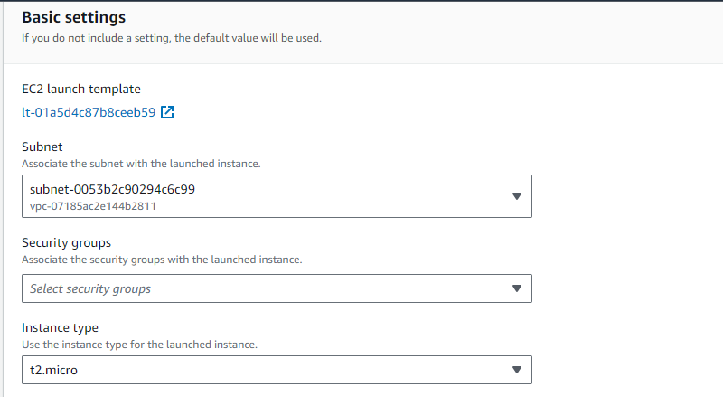
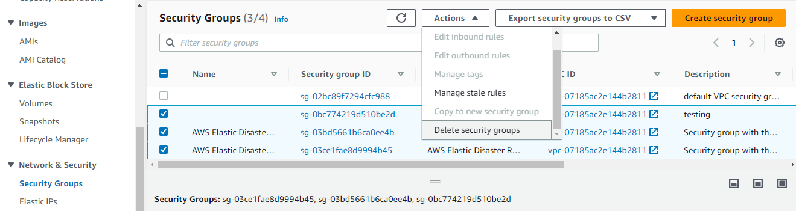
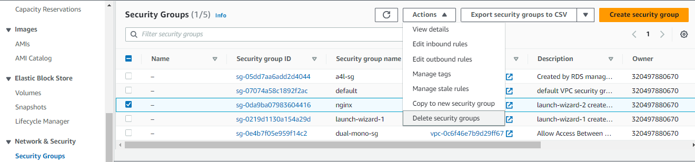

# Elastic Disaster Recovery (AWS DRS) Setup Guide

## Overview

This guide provides step-by-step instructions to set up a basic Nginx EC2 instance and install the Elastic Disaster Recovery agent. The agent will enable replication of the instance/application to another AWS region.

For this demonstration, the primary Nginx instance will be configured in the North Virginia region (us-east-1), while the disaster recovery (secondary) instance will be set up in the Ohio region (us-east-2). You can choose different regions as per your requirement, ensuring that the destination region supports the "Elastic Disaster Recovery" service. Refer to the AWS Regional Product Services page for more information: [https://aws.amazon.com/about-aws/global-infrastructure/regional-product-services](https://aws.amazon.com/about-aws/global-infrastructure/regional-product-services)

Please note that this demo involves using SSH to connect to a server and execute commands.

## Instructions

### Stage 1 - Create the instance

1. Open the EC2 console by navigating to [https://us-east-1.console.aws.amazon.com/ec2/home](https://us-east-1.console.aws.amazon.com/ec2/home).
2. Click on **Launch instance**.
3. Set the **Name** as "nginx-primary".
4. Leave the default **Amazon Linux** selection under **AMI**.
5. Keep the **Instance type** as "t2.micro".
6. Under **Key pair (login)**, select an existing key pair or create a new one.

   If creating a new key pair:
   
   
   
   You can provide any **Key Pair Name**, and leave the **Key Pair Type** unchanged. However, the **Private Key File Format** depends on the operating system you will be using. If you are using a Mac or Linux PC, select ".pem". For Windows users using the PuTTY program, select ".ppk". Note that this demo does not cover SSH connection setup; it focuses on the commands to be executed once connected.

7. Click on **Edit** under **Network Settings**.

8. You can either change the **VPC** or keep it as the default VPC. For this demo, we will use the default VPC. Leave the **Subnet** as "No preference", but make sure to enable **Auto-assign public IP**.

9. Under **Firewall (security groups)**, select **Create security group** and name it "nginx". You can leave the description as it is.

   

10. Leave the default rule that allows SSH access from anywhere, and click on **Add security group rule**.

11. Change the **Type** to "HTTP" and the **Source type** to "Anywhere".

    

    Now, both SSH and HTTP traffic will be allowed from any IP address. In a production environment, it is recommended to use HTTPS and restrict SSH access to specific IP addresses. However, this demo does not cover those configurations.

12. Leave all other settings as default and click on **Launch instance**.

13. On the next page, click on **View all instances**.

    

14. Wait for your instance to finish booting up, as it may take a couple of minutes.
15. Note down the **Public IPv4 address** of your instance, as it will be required in the next step.

By following these instructions, you will have successfully created an EC2 instance with Nginx installed. In the next stages, we will proceed with setting up the Elastic Disaster Recovery agent and configuring replication to the secondary instance in the Ohio region.

## Stage 2 - Configuring Elastic Disaster Recovery

To begin the setup process for Elastic Disaster Recovery in your desired region, which in this case is Ohio (us-east-2), follow these steps:

1. Access the Disaster Recovery Service (DRS) console by visiting: [https://us-east-2.console.aws.amazon.com/drs/home?region=us-east-2#/welcome](https://us-east-2.console.aws.amazon.com/drs/home?region=us-east-2#/welcome).

2. Once you're on the console page, you will be prompted with the initial setup wizard.

3. Under the **Replication server configuration** section, you have the option to modify the default destination subnet for replicated servers and the default instance type. For now, we will keep these settings as the default.

4. Click on the **Next** button to proceed.

5. On the next page, leave all the options at their default settings and click **Next**.

6. Repeat the same step for the following page, leaving all options unchanged, and click **Next**.

7. Under the **Set default DRS launch settings**, Change the **Instance type right-sizing** to **Inactive**, and click **Next**.

8. On the next page, leave all the options at their default settings and click **Next**.

9. Finally, on the last page, click on **Configure and Initialize**.

8. After completing the above steps, you will be redirected to the "Source servers" page. At this point, DRS is ready to establish connections with agents (source servers) for data replication.

## Stage 3 - Generating Temporary IAM Access Keys

To set up the initial replication connection, Elastic Disaster Recovery requires temporary IAM credentials. Please follow the instructions below:

1. Access the IAM console by visiting: [https://us-east-1.console.aws.amazon.com/iamv2/home#/users](https://us-east-1.console.aws.amazon.com/iamv2/home#/users).

2. Navigate to the **Users** page and select your username.

3. On the **Permissions** tab, if you already have "AdministratorAccess" privileges, you can skip this part and proceed to create your access keys.

4. If you don't have the required permissions, click on **Add permissions**, followed by another **Add permissions** button.

5. Choose "Attach policies directly" and search for `AWSElasticDisasterRecoveryAgentInstallationPolicy`. Select it and click on **Next**, then **Add permissions**.

6. Now, let's generate the Access Keys needed for the next step. Go to the **Security credentials** tab and scroll down to the **Access keys** section. Click on **Create access key**.

7. On the next page, select "Command Line Interface (CLI)" and confirm your selection by checking the box.

8. Click on **Next**.

9. In the **Description tag value** field, enter "Temporary DRS install key", and click on **Create access key**.

10. Make sure to copy and securely store both the **Access key** and **Secret access key**. You will need these for the next step.

11. Finally, click on **Done** to complete the process.

## Stage 4 - Elastic Disaster Recovery Agent Installation

To proceed with the installation of the Elastic Disaster Recovery agent, follow the steps below:

1. Return to the Instance created in us-east-1 and SSH into your instance using the public IP address you copied earlier. The default user for Amazon Linux 2 is `ec2-user`.

2. Install and start Nginx by executing the following commands:

```bash
sudo amazon-linux-extras install -y nginx1
sudo systemctl start nginx.service
sudo systemctl enable nginx.service
```

3. To verify if Nginx is functioning correctly, open your browser and visit the IP address of your instance. Ensure that you use `http://54.175.154.77` (replace this IP with your instance IP) and not HTTPS, as HTTPS will not work in our demo.

   

4. Once the "application" is up and running, proceed to install the DRS agent. Return to your SSH console and execute the following commands:

```bash
sudo yum install -y kernel-devel-`uname -r`
wget -O ./aws-replication-installer-init.py https://aws-elastic-disaster-recovery-us-east-1.s3.us-east-1.amazonaws.com/latest/linux/aws-replication-installer-init.py
sudo python3 aws-replication-installer-init.py
```

5. You will be prompted for the following information:

    - **AWS Region Name**: This refers to the destination region. For example, in my case, it is us-east-2.

    - **AWS Access Key ID**: Enter the key generated in the previous step.

    - **AWS Secret Access Key**: Enter the secret key generated in the previous step.

6. When prompted with `To replicate some of the disks, type the path of the disks, separated with a comma (for example, /dev/sda, /dev/sdb). To replicate all disks, press Enter:`, press <kbd>Enter</kbd> to replicate all disks.

7. The script will commence the installation of the AWS Replication Agent, which may take a few minutes to complete.

8. Here is an example output for reference:

   

## Stage 5 - Configuring Disaster Recovery Service (DRS) Launch Settings

To configure the launch settings for DRS recovery, follow these steps:

1. Switch to your destination region. For this example, we will use Ohio (us-east-2).

2. Access the DRS console by visiting the following link: [https://us-east-2.console.aws.amazon.com/drs/home](https://us-east-2.console.aws.amazon.com/drs/home)

3. Under the **Source Servers** section, you will find your instance from the source region. It will either be currently syncing or have completed syncing.

   

   Please note that the time taken for this synchronization process may vary depending on the region and instance size. In this case, it took approximately 20 minutes to complete.

4. Proceed to the EC2 console by visiting: [https://us-east-2.console.aws.amazon.com/ec2/home](https://us-east-2.console.aws.amazon.com/ec2/home)

5. You should now see a new instance created by Elastic Disaster Recovery. This instance facilitates the replication between your source server and DRS. However, it is important to note that this is not the server used during a disaster or failover.

   

6. Return to the DRS console: [https://us-east-2.console.aws.amazon.com/drs/home](https://us-east-2.console.aws.amazon.com/drs/home)

7. Once your source server is in the **Ready** state, click on the hostname of the server.

   

8. On the next page, navigate to the **Launch settings** section.

9. Under **EC2 launch template**, there are a few settings that need to be modified. You will notice that the instance type is too large for our testing, no security groups are applied (resulting in restricted access), and there is no public IP. To address these issues, click on **Edit**.

    

10. On the subsequent page, under **Instance Type**, change the instance type to "t2.micro" to stay within the free tier.

    

11. Scroll down to **Network Settings** and select **Create security group**. Set the **Security Group Name** to "nginx", the **Description** to "Testing", and leave the **VPC** as default.

12. Click on **Add security group rule**.

    Change the **Type** to "HTTP" and the **Source Type** to "Anywhere".
	
13. Further down under **Network Settings**, expand **Advanced network configuration** and enable **Auto-assign Public IP**.

    

14. Once the modifications are complete, click **Update Template**.

## Stage 6 - Test Recovery Execution

Performing a test recovery is an essential step in ensuring the successful replication and failover of your source server to the destination region. Follow the steps below to initiate the recovery drill:

1. Access the AWS Disaster Recovery Service (DRS) console by visiting: [DRS Console](https://us-east-2.console.aws.amazon.com/drs/home)

2. Navigate to the **Source servers** page, located within the console, and select your designated source server.

3. Click on the **Initiate recovery job** button, followed by **Initiate Recovery Drill**.

   

4. On the subsequent page, accept the default options and proceed by clicking **Initiate drill**.

   Please note that the process may take a few minutes to complete. To monitor the status of the job, you can visit the **Recovery Job History** page.

   

5. The **Recovery Drill** process allows you to perform test restores to an instance in the destination region. This allows you to verify connectivity and ensure the successful startup of both the server and its associated applications.

6. Once the recovery job is finished, you can locate the newly created instance in the Amazon EC2 console. Begin by clicking on the instance name.

   

7. Proceed by selecting "View in EC2" to access the EC2 console.

   

8. In the EC2 console, make note of the IP address associated with the instance. Open your preferred web browser and enter the IP address in the address bar.

   

9. The Nginx welcome page should be displayed, indicating a successful replication of the source server to the destination region. This confirms that the server can be restored or failed over at any given time. Moreover, it provides confidence that the basic application starts up and fails over smoothly.

   

By following these steps, you have successfully executed a test recovery, validating the replication process and ensuring the readiness of your infrastructure for failover operations.

## Stage 7 - Clean up

To perform the clean-up process in the destination region (us-east-2), follow these steps:

1. Access the DRS console by visiting the following link: [https://us-east-2.console.aws.amazon.com/drs/home](https://us-east-2.console.aws.amazon.com/drs/home).

2. In the DRS console, navigate to the **Recovery instances** section and choose your instance. Then, click on **Actions** and select **Terminate recovery instances**.

   

3. Next, go to the **Source servers** section, select your instance, and click on **Actions**. Then, choose **Disconnect from AWS**.

   

4. In the confirmation box, click on **Disconnect**. This action deletes all replicated data and disconnects the source instance from Elastic Disaster Recovery.

5. Select your instance again, click on **Actions**, and then select **Delete server**.

   

6. In the confirmation box, click on **Permanently delete**.

To continue the clean-up process, proceed to the EC2 console by visiting the following link: [https://us-east-2.console.aws.amazon.com/ec2/v2/home](https://us-east-2.console.aws.amazon.com/ec2/v2/home).

7. In the EC2 console, go to the **Instances** section. If there are any running instances, select them, click on **Instance state**, and then choose **Terminate Instance**.

   Please exercise caution to only delete instances created in this demo.

   

8. Click on **Terminate** in the confirmation box.

9. Switch to the **Volumes** section, select any volumes associated with the AWS Elastic Disaster Recovery service, click on **Actions**, and then choose **Delete Volume**.

   

10. In the confirmation box, type "delete" and click on **Delete**.

11. Move to the **Snapshots** section, select all snapshots related to the AWS Elastic Disaster Recovery service, click on **Actions**, and then choose **Delete Snapshot**.

    

12. In the confirmation box, type "delete" and click on **Delete**.

13. Proceed to the **Security Groups** section, select all security groups associated with the AWS Elastic Disaster Recovery service, click on **Actions**, and then choose **Delete security groups**.

    

14. In the confirmation box, type "delete" and click on **Delete**.

For the clean-up process in the source region (us-east-1), follow these steps:

1. Access the EC2 console by visiting the following link: [https://us-east-1.console.aws.amazon.com/ec2/v2/home](https://us-east-1.console.aws.amazon.com/ec2/v2/home).

2. In the EC2 console, go to the **Instances** section. Select the initial demo nginx instance that was created and click on **Instance state**. Then, choose **Terminate Instance**.

   

3. Click on **Terminate** in the confirmation box.

4. Proceed to the **Security Groups** section, select the security group created earlier, click on **Actions**, and then choose **Delete security groups**.

   

5. In the confirmation box, click on **Delete**.

6. Move to the **Key Pairs** section, select the key pair created earlier, click on **Actions**, and then choose **Delete**.

   

7. In the confirmation box, type "Delete" and click on **Delete**.

To complete the clean-up process, follow these steps:

1. Access the IAM console by visiting the following link: [https://us-east-1.console.aws.amazon.com/iamv2/home#/users](https://us-east-1.console.aws.amazon.com/iamv2/home#/users).

2. Go to the **Users** page and click on your username.

3. On the **Permissions** tab, if you added the `AWSElasticDisasterRecoveryAgentInstallationPolicy` policy, select it and click on **Remove**.

4. Click on **Remove policy** in the confirmation window.

5. Switch to the **Security Credentials** tab, scroll down to **Access Keys**, and click on **Actions**. Then, select **Deactivate** next to the key you created earlier.

   

6. Click on **Deactivate** in the confirmation box.

	

7. Now, click on **Actions** and select **Delete** next to the key you created earlier.

8. Enter the Access Key in the confirmation box and click on **Delete**.
